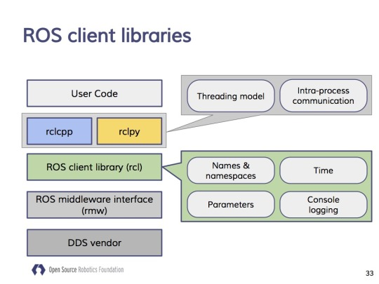
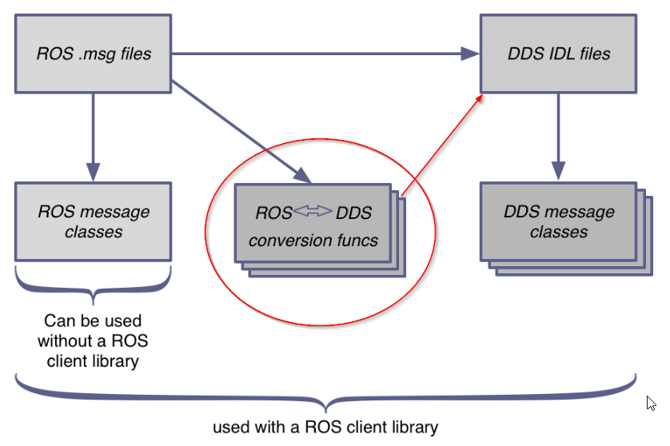
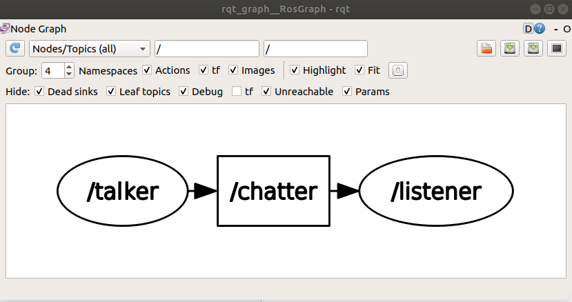

# ROS 2 Crash Course

Author: methylDragon  
Fairly comprehensive ROS 2 crash course!  
I'll be adapting it from the ROS 2 Tutorials: <https://index.ros.org/doc/ros2/Tutorials/>    
and [some other places](<http://docs.erlerobotics.com/robot_operating_system/ros2>)

------

## Pre-Requisites

- A system with Ubuntu 18.04+ installed
- Linux knowledge
- Python 3 and/or C++
- Prior ROS 1 experience
  - Basic concepts will not be explained so well
  - Knowledge from the [ROS1 tutorial](../ROS) will be presumed (like setting up Ubuntu, etc.)
- Prior DDS experience will help as well


## Table Of Contents


## Introduction

ROS 2 was built to overcome some of the limitations of ROS 1, and as a means to refresh the interfaces and technologies used. (Eg. ROS 2 targets C++11 onwards and Python 3.5 while ROS 1 is usually stuck with Python 2 and C++4)

**It is NOT built on ROS1. It's a completely separate framework altogether!** Although, it can interface with ROS 1. Sometimes people like to make multi-robot fleets, and control individual robots using ROS 1, using ROS 2 to control the overall fleet instead.

It features several key improvements as a result of switching its messaging layer to a Data Distribution Service (DDS) implementation as middleware (eProsima's FastRTPS by default, though CycloneDDS might become the standard.)

> The *Data Distribution* Service (*DDS*) for real-time systems is an Object Management Group (OMG) machine-*to*-machine (sometimes called middleware or connectivity framework) standard that aims *to*enable dependable, high-performance, interoperable, real-time, scalable data exchanges using a publish–subscribe pattern.
>
> <https://en.wikipedia.org/wiki/Data_Distribution_Service>

> DDS is used in lots of stuff! Like:
>
> - Battleships
> - Dams
> - Financial systems
> - Space systems
> - Flight systems
> - Train switchboards
>
> <https://design.ros2.org/articles/ros_on_dds.html>

Paired with the renewed development efforts aimed at properly targeting new use cases, these benefits include:

- The system is truly distributed, supporting peer to peer **discovery**
- Quality of service protocols can be implemented to help with enforcing real time system architectures as well as dealing with packet losses
- It still works with ROS 1! (If you have a bridge.)
- Multi-platform and OS support

> Much has happened since and many situations, initially not covered by the framework, have demanded a solution. ROS 2 address some of these limitations putting specific effort into the following robotic problems:
>
> - **Teams of multiple robots**
> - **Small embedded and deep embedded platforms either microcontroller or microprocessor-based.**
> - **Real-time systems**
> - **Non-ideal networks**
> - **Production environments**
> - **Prescribed patterns for building and structuring systems**
>
> The Robot Operating System (ROS) 2 will define the next decade of robotics so read up!
>
> <http://design.ros2.org/articles/why_ros2.html>

You can read more about changes between ROS 1 and ROS 2 [here](<http://design.ros2.org/articles/changes.html>).

Additionally, since ROS 2 is using a middleware layer, it is fairly simple to switch DDS implementations if the need arises. But that particular functionality will be treated as outside the scope of this tutorial.


## Installation

### Installing ROS 2

This particular tutorial is configured to install ROS 2 Dashing for Ubuntu 18.04.

But if you want a different distribution, or want to install on Windows or Mac, check out [the docs](<https://index.ros.org/doc/ros2/Installation/Dashing/Linux-Install-Debians/>).

**Add Keys**

```shell
sudo apt update && sudo apt install curl gnupg2 lsb-release
curl -s https://raw.githubusercontent.com/ros/rosdistro/master/ros.asc | sudo apt-key add -

sudo sh -c 'echo "deb [arch=amd64,arm64] http://packages.ros.org/ros2/ubuntu `lsb_release -cs` main" > /etc/apt/sources.list.d/ros2-latest.list'
```

**Install ROS 2 Dashing**

```shell
sudo apt update

# For computer
sudo apt install ros-dashing-desktop

# For robot base
sudo apt install ros-dashing-ros-base
```

**Install Helpers**

```shell
sudo apt install python3-argcomplete
sudo apt install python3-colcon-common-extensions
```

**Setup Sourcing**

> **Note**: If you want to run this alongside ROS1, be sure to selectively source the setup.bashes. They normally can't be sourced together!

```shell
echo "source /opt/ros/dashing/setup.bash" >> ~/.bashrc
```

**Install ROS 1 Bridge**

```shell
sudo apt update
sudo apt install ros-dashing-ros1-bridge
```


### Optional: Installing Additional Middleware Implementations

These are **optional**! They're also not really fully supported.

```shell
sudo apt update

# OpenSplice
sudo apt install ros-dashing-rmw-opensplice-cpp

# RTI Connext (requires license agreement)
sudo apt install ros-dashing-rmw-connext-cpp
```

To use them, ensure the following environment variables are set:

```shell
# For Opensplice
export RMW_IMPLEMENTATION=rmw_opensplice_cpp

# For RTI Connect
export RMW_IMPLEMENTATION=rmw_connext_cpp
```


## colcon

**colcon - collective construction**

Before we can really get into the nitty gritty of how ROS 2 works, and all the wonderful coding examples that are floating out there. It's important to first learn about how to even build a ROS 2 package in the first place.


### Introduction

[colcon](<https://colcon.readthedocs.io/en/released/user/quick-start.html>) is the [universal build tool](<http://design.ros2.org/articles/build_tool.html>) that iterates on all past build tools (`catkin`, `catkin_make`, and `ament_tools`) that is meant to allow you to build ROS 1 and ROS 2 packages.

> The goal of a unified build tool is to build a set of packages with a single invocation. It should work with ROS 1 packages as well as ROS 2 packages which provide the necessary information in their manifest files. It should also work with packages that do not provide manifest files themselves, given that the necessary meta information can be inferred and/or is provided externally. This will allow the build tool to be utilized for non-ROS packages (e.g. Gazebo including its ignition dependencies, sdformat, etc.).
>
> <http://design.ros2.org/articles/build_tool.html>


### Directories

Like ROS 1 with `catkin`, ROS 2 packages are built within workspaces. These workspaces include several directories.

| Directory | Description                                                 |
| --------- | ----------------------------------------------------------- |
| src       | Package source files                                        |
| build     | Intermediate build files                                    |
| install   | Package installation directory. Each built binary goes here |
| log       | Log information about the build process                     |

> Notably, there is no `devel` directory, unlike in ROS 1's `catkin`.


### Command Line

You can invoke `colcon` using the command line. Invoke them in the workspace directory!

```shell
$ colcon list -g            # List all packages in the workspace and their dependencies
$ colcon build              # Build all packages in the workspace
$ colcon test               # Test all packages in the workspace
$ colcon test-result --all  # Enumerate all test results

$ colcon build --packages-select <name-of-pkg> # Individual build
$ colcon build --packages-up-to <name-of-pkg>  # Selective build
```


### Creating an Example Workspace

Ok! So let's just go ahead and create our example workspace that we'll use to go through the tutorial with. We'll be using the ros2 example repository.

```shell
# Create workspace
mkdir -p ~/ros2_example_ws/src
cd ~/ros2_example_ws

# Clone examples and checkout the relevant branch
git clone https://github.com/ros2/examples src/examples
cd ~/ros2_example_ws/src/examples/
git checkout $ROS_DISTRO
cd ~/ros2_example_ws

# Source the underlay (the underlying ROS 2 installation)
# In this case we're using Dashing, but if you're using something else,
# Go ahead and change it
source /opt/ros/dashing/setup.bash

# Build!
colcon build --symlink-install

# Source the built environment
. install/setup.bash
```

> **Note**: The symlink-install flag creates a symlink to the install space that allows you to change **uncompiled** source files from the source space for faster iteration speed. If you're building compiled sources though, you will still need to rebuild.


## Concepts

### ROS 1 vs ROS 2

It makes sense to first go briefly through the differences between ROS 1 and ROS 2.

#### **Structure**


[Image Source](<https://www.semanticscholar.org/paper/Exploring-the-performance-of-ROS2-Maruyama-Kato/07b895f3b584dea4f64e91844f243de382026b20/figure/0>)

Mainly:

- **There's no master**! ROS 2 nodes auto discover topics and each other without a master!
  - We'll go through this later, but you **can** make a node a daemon, which will take the role of a **non-essential** master
- **There's an extra middleware layer**! Since ROS 2 is an abstraction layer built on DDS, it does not implement its own communication layer, instead relying on DDS implementations.
- **It supports multiple OSes**! While ROS 1 support has only recently actually reached beyond Linux OSes, ROS 2 was built to be OS and hardware agnostic from the get go!


#### **Use Cases and Features**

[Source](<https://speakerdeck.com/youtalk/dds?slide=11>)

|                        |      ROS 1       |                        ROS 2                         |
| :--------------------: | :--------------: | :--------------------------------------------------: |
|  **Number of Robots**  |      Single      |                     Multi-robot                      |
|    **Computation**     | Workstation Only |               Embedded or Workstation                |
|      **Realtime**      |        No        |                         Yes                          |
|  **Network Quality**   |   Stable Only    |               Lossy/Delayed or Stable                |
|    **Applications**    |     Research     |               Research and Production                |
|      **Security**      |     Insecure     | Authentication, Permissions, DDS-Security Encryption |
| **Quality of Service** |       None       |                Provisioned within DDS                |


### DDS

Since ROS 2 is built on DDS, it makes a little bit of sense to go through it. Remember again that:

> The *Data Distribution* Service (*DDS*) for real-time systems is an Object Management Group (OMG) machine-*to*-machine (sometimes called middleware or connectivity framework) standard that aims *to*enable dependable, high-performance, interoperable, real-time, scalable data exchanges using a publish–subscribe pattern.
>
> <https://en.wikipedia.org/wiki/Data_Distribution_Service>

**DDS is a standard**, with various implementations of said standard.


[Image Source](<https://www.semanticscholar.org/paper/Exploring-the-performance-of-ROS2-Maruyama-Kato/07b895f3b584dea4f64e91844f243de382026b20/figure/4>)

- The **Global Data Space** (GDS) exists within a specific **domain** with a domain ID.

  - It is **fully distributed** and exists across all nodes within the domain network
  - This means that it has **no single point of failure**
  - Additionally, the GDS may be **optionally partitioned** into **partitions** within a network, which allows multiple 'domains' to exist within the same network without talking to each other. 

- **Participants** are the objects that grant access to the GDS.

  - They're typically individual processes, much like ROS 1 nodes

- Participants contain **Publishers** and **Subscribers**, which further make use of **Data Writers** and **Data Readers** respectively.

  - The publishers and subscribers are the interfaces through which one might push or fetch data to and from the GDS
  - The data writers and readers are the actual objects that interact with the GDS.

- And everything can ultimately be governed through each specific **implementation of the DDS communication protocol**, and any **underlying Quality of Service (QoS) policies**.

  - Examples of QoS policies

    | Reliability                                      | History             | Durability                                                   |
    | :----------------------------------------------- | :------------------ | :----------------------------------------------------------- |
    | Best Effort (Might lose data)                    | Keep last N samples | Transient and local (Publisher becomes responsible for persisting samples for late-joining subscribers) |
    | Reliable (Guarantees data delivery, might retry) | Keep all samples    | Volatile (No effort to persist samples)                      |


### ROS 2 Architecture

Whew! Time to actually get down to business.

**First, the simple view:**


[Image Source](<https://design.ros2.org/articles/ros_on_dds.html>)

Cool. 

So your **code** talks to the **ROS 2 client library**, which **leverages the DDS API**, to talk to one of any number of **specific DDS implementations**.

**Ok, let's get a bit more complicated:**



[Image Source]([https://roscon.ros.org/2016/presentations/ROSCon%202016%20-%20ROS%202%20Update.pdf](https://roscon.ros.org/2016/presentations/ROSCon 2016 - ROS 2 Update.pdf))

**And we'll just jump into the full one:**


[Image Source](<http://docs.ros2.org/crystal/developer_overview.html>)

The above image should be self-explanatory. You'll generally only have to deal with the client library layers anyway. (`rclcpp`, `rclpy`), but it helps to be roughly aware of what's going on under the hood.


### ROS 2 Internals

There are a bunch of helper scripts **that you will generally never have to care about** that goes about generating all the necessary **interactive data language** (.idl) files, that will be necessary for interacting with the DDS layer.

It helps to know the flow though.

#### **Message Overview**



[Image Source](<https://answers.ros.org/question/293144/ros2-conversion-of-msg-files-into-idl-files/>)

ROS .msg files are used within ROS, whereas DDS .idl files will be used within the DDS middleware. The .msg files are used to automatically generate the .idl files that will be used in the communication middleware layer. You don't have to care about this, and just have to concern yourself with writing nice .msg files.

#### **Static Type Generation**


[Image Source](<http://docs.ros2.org/crystal/developer_overview.html#internal-api-architecture-overview>)

> ### Static Type Support
>
> When the type support references code to do particular functions for a specific message type, that code sometimes needs to do middleware specific work. For example, consider the type specific publish function, when using “vendor A” the function will need to call some of “vendor A“‘s [API](http://docs.ros2.org/crystal/glossary.html#term-api), but when using “vendor B” it will need to call “vendor B“‘s [API](http://docs.ros2.org/crystal/glossary.html#term-api). To allow for middleware vendor specific code, the user defined `.msg` files may result in the generation of vendor specific code. This vendor specific code is still hidden from the user through the type support abstraction, which is similar to how the “Private Implementation” (or Pimpl) pattern works.
>
> ### Static Type Support with DDS
>
> For middleware vendors based on DDS, and specifically those which generate code based on the OMG IDL files (`.idl` files), the user defined `rosidl` files (`.msg` files) are converted into equivalent OMG IDL files (`.idl` files). From these OMG IDL files, vendor specific code is created and then used within the type specific functions which are referenced by the type support for a given type. The above diagram shows this on the left hand side, where the `.msg` files are consumed by the `rosidl_dds` package to produce `.idl` files, and then those `.idl` files are given to language specific and DDS vendor specific type support generation packages.

#### **Dynamic Type Generation**


[Image Source](<http://docs.ros2.org/crystal/developer_overview.html#dynamic-type-support>)

> Another way to implement type support is to have generic functions for things like publishing to a topic, rather than generating a version of the function for each message type. In order to accomplish this, this generic function needs some meta information about the message type being published, things like a list of field names and types in the order in which they appear in the message type. Then to publish a message, you call a generic publish function and pass a message to be published along with a structure which contains the necessary meta data about the message type. This is referred to as “dynamic” type support, as opposed to “static” type support which requires generated versions of a function for each type.
>
> <http://docs.ros2.org/crystal/developer_overview.html#dynamic-type-support>


### ROS 2 Graph Concepts

[Source](<https://index.ros.org//doc/ros2/Concepts/Overview-of-ROS-2-concepts/>)

> ROS is a middleware based on an anonymous publish/subscribe mechanism that allows for message passing between different ROS processes.
>
> At the heart of any ROS 2 system is the ROS graph. The ROS graph refers to the network of nodes in a ROS system and the connections between them by which they communicate.

The main concepts that involve the ROS 2 graph are as follows. You should be fairly familiar with them since you've gone through the ROS 1 tutorial.

- **Nodes**
  - The participants within the ROS graph that communicate using messages, via topics
- **Messages**
  - ROS data packets that are sent around the ROS graph
- **Topics**
  - The channels through which messages are subscribed or published to
- **Discovery**
  - The process through which nodes determine how to talk to each other
  - This was what the ROS 1 master would be in charge of. But now all nodes can do it!


#### **Nodes. Messages, and Topic**

Every node is a DDS participant in the ROS graph. They have more or less the same functionalities as ROS 1 nodes, in that they can:

- Publish and subscribe
- Provide or use services
- Read and set parameters
- Exist on the same or different computers and processes (as long as they're connected to the same network)

But notably, **since there is no ROS master**, there is **no single point of failure**.

Instead, nodes go through a process of distributed discovery, which establishes connections between nodes, topics, and other participants in the DDS network.

Specifically, **every node actually has its own list of registered connections that it updates automatically**. This means that **discovery is slower and takes up more space**, but with the benefit of being **truly distributed**. This can be mitigated through use of a daemon, which we will talk about later on.

Messages and topics will present about the same interfaces as ROS 1, but are actually implemented in DDS. Though, since they are implemented in DDS, they can include **security and QoS layers**.


#### **ROS Domain**

Just like with DDS domains, ROS domains exist and have IDs associated with them. This is very important since multiple ROS 2 networks running on the same LAN network can potentially communicate with each other! Set a unique **ROS_DOMAIN_ID** to prevent unwanted communication!


#### **Discovery**

> Discovery of nodes happens automatically through the underlying middleware of ROS 2. It can be summarized as follows:
>
> 1. When a node is started, it advertises its presence to other nodes on the network with the same ROS domain (set with the ROS_DOMAIN_ID environment variable). Nodes respond to this advertisement with information about themselves so that the appropriate connections can be made and the nodes can communicate.
> 2. Nodes periodically advertise their presence so that connections can be made with new-found entities, even after the initial discovery period.
> 3. Nodes advertise to other nodes when they go offline.
>
> Nodes will only establish connections with other nodes if they have compatible [Quality of Service](https://index.ros.org//doc/ros2/Tutorials/Quality-of-Service/) settings.

Note that this means that every node keeps track of the other nodes in an internal discovery list.


### ROS 2 Client Libraries

Client libraries are the libraries and APIs that you will leverage to talk with the entire ROS 2 system. They're built to abstract away the nitty gritty DDS stuff, and help you maintain consistent behaviour while being easier to write.

We'll only talk about `rclcpp` and `rclpy`, the ROS Client Libraries for C++ and Python respectively.

There are [a bunch of others though!](<https://index.ros.org//doc/ros2/Concepts/ROS-2-Client-Libraries/>)

At time of writing theres client libraries for:

- JVM and Android
- Objective C and iOS
- C#
- Swift
- Node.js
- Ada
- _.NET Core, UWP, and C#


### Quality of Service (QoS)

[Source](<https://index.ros.org/doc/ros2/Concepts/About-Quality-of-Service-Settings/>)

Since ROS 2 uses DDS implementations for its middleware layer, we have the benefit of using Quality of Service protocols to govern how data we send through the middleware layer is treated!

We can configure them for different situations and needs!

**Do note that not every available DDS QoS policy is made available through ROS 2**. The abstraction layer removes some functionalities.

#### **QoS Policies**

> The base QoS profile currently includes settings for the following policies:
>
> - **History**
>   - Keep last: only store up to N samples, configurable via the queue depth option.
>   - Keep all: store all samples, subject to the configured resource limits of the underlying middleware.
> - **Depth**
>   - Size of the queue: only honored if used together with “keep last”.
> - **Reliability**
>   - Best effort: attempt to deliver samples, but may lose them if the network is not robust.
>   - Reliable: guarantee that samples are delivered, may retry multiple times.
> - **Durability**
>   - Transient local: the publisher becomes responsible for persisting samples for “late-joining” subscribers.
>   - Volatile: no attempt is made to persist samples.
>
> <https://index.ros.org/doc/ros2/Concepts/About-Quality-of-Service-Settings/>

You'll be able to select and tune these using the ROS 2 client libraries. They're all provisioned for you there.

For comparisons to ROS 1, the following are approximately similar

|         ROS 2 QoS         |                         ROS 1 Config                         |
| :-----------------------: | :----------------------------------------------------------: |
| **History** and **Depth** |                        **Queue Size**                        |
|      **Reliability**      | **UDPROS** for "best effort", **TCPROS** (default) for "reliable" |
|      **Durability**       |                      **Latched Topics**                      |


#### **QoS Profiles**

You can also **aggregate QoS policies to form a profile** to make things easier. ROS 2 comes with a few of these.

The profiles can be found [here](<https://github.com/ros2/rmw/blob/release-latest/rmw/include/rmw/qos_profiles.h>), for `rmw`. The client libraries will leverage these C structs when utilising profiles.

> The currently-defined QoS profiles are:
>
> - **Default QoS settings for publishers and subscribers**
>
>   In order to make the transition from ROS 1 to ROS 2, exercising a similar network behavior is desirable. By default, publishers and subscribers are **reliable** in ROS 2, have **volatile durability, and “keep last” history**.
>   
>
> - **Services**
>
>   In the same vein as publishers and subscribers, services are **reliable**. It is especially important for services to use **volatile durability**, as otherwise service servers that re-start may receive outdated requests. While the client is protected from receiving multiple responses, the server is not protected from side-effects of receiving the outdated requests.
>   
>
> - **Sensor data**
>
>   For sensor data, in most cases it’s more important to receive readings in a timely fashion, rather than ensuring that all of them arrive. That is, developers want the latest samples as soon as they are captured, at the expense of maybe losing some. For that reason the sensor data profile uses **best effort reliability and a smaller queue depth**.
>   
>
> - **Parameters**
>
>   Parameters in ROS 2 are **based on services, and as such have a similar profile**. The difference is that parameters use a **much larger queue depth** so that requests do not get lost when, for example, the parameter client is unable to reach the parameter service server.
>   
>
> - **System default**
>
>   This uses the system default for all of the policies.
>
> Source: <https://index.ros.org/doc/ros2/Concepts/About-Quality-of-Service-Settings/>

You can of course define your own by mixing and matching various QoS policies made available to you by the ROS 2 client libraries.


#### **QoS Compatibilities**

Remember that in order for nodes to talk to each other, they **need to have compatible QoS profiles**. 

- Connections are **only made if the requested policy of the subscriber is as or less stringent than the publisher**.
- If this is held, then the **less strict of the two policies will be used**.
- Both **durability and reliability** profiles have to be compatible!!

> ***Compatibility of QoS durability profiles:***
>
> | Publisher       | Subscriber      | Connection | Result          |
> | :-------------- | :-------------- | :--------- | :-------------- |
> | Volatile        | Volatile        | Yes        | Volatile        |
> | Volatile        | Transient local | **No**     |                 |
> | Transient local | Volatile        | Yes        | Volatile        |
> | Transient local | Transient local | Yes        | Transient local |
>
> ***Compatibility of QoS reliability profiles:***
>
> | Publisher   | Subscriber  | Connection | Result      |
> | :---------- | :---------- | :--------- | :---------- |
> | Best effort | Best effort | Yes        | Best effort |
> | Best effort | Reliable    | **No**     |             |
> | Reliable    | Best effort | Yes        | Best effort |
> | Reliable    | Reliable    | Yes        | Reliable    |


### ROS 2 Daemon

😈 :eyes:

This is only relevant for when we're using a command line interface (CLI), but...

If you're on the CLI, it is possible to start a ROS 2 Daemon, **which fulfills the same role that the ROS master fills in ROS 1**! (With the added benefit where **if the ROS 2 Daemon dies, the node registration process can still continue due to dynamic discovery**!)

The daemon's role is to **listen to the discovery traffic** and **create the ROS 2 graph internally**.

The benefit of this is that, instead of having to wait for nodes to discover themselves, and rely on the multiple broadcasts and responses from every node that they're trying to contact, **nodes instead defer to the daemon to do it for them, and request for the ROS 2 graph from the daemon directly, bypassing their normal discovery process**. This speeds up the process by a lot, and also decreases network bandwidth use, but only during the discovery process.

To start the daemon, you just have to **use the CLI**. Any command that tries to use the daemon (`ros2 daemon ...`) will result in the daemon starting automatically.


## ROS 2 Basics

### Command Line Interface

Ok! Now let's get down and dirty with the CLI for ROS 2. Exciting stuff!

#### **Preface**

I'll presume that you've installed ROS 2 already, and also sourced the workspace

```shell
source /opt/ros/<YOUR_ROS2_DISTRO>/setup.bash
```

> **Note**: Do be aware that sourcing both ROS 1 and ROS 2 will break some stuff due to common naming, so make sure you do this in a terminal that does not have ROS 1 sourced!

#### **Basic Command Structure**

If you've played around with ROS 1, you'll know that the ROS 1 command structure goes something like this

```shell
$ rosrun    ...
$ roslaunch ...
$ rosparam  ...
$ rostopic  ...
```

For ROS 2, the commands have broken into two

```shell
$ ros2 launch ...
$ ros2 topic  ...
$ ros2 param  ...
```

More generally,

```shell
$ ros2 <verb> <sub-verb> <arguments ...> <optional arguments ...>
```

#### **Commands**

This list is non-exhaustive! **Make heavy use of tab completion or the help argument to find out more commands**!

> Sadly some of the nice commands like `roswtf` and `roscd` currently have no analogs in ROS 2.

There's a [cheatsheet](<https://github.com/artivis/ros2_cheats_sheet/blob/master/cli/cli_cheats_sheet.pdf>) too if you want to use it.

```shell
# Get help
$ ros2 <verb> --help
$ ros2 <verb> <sub-verb> -h

# Run
# Same deal: ros2 run <PACKAGE_NAME> <NODE_NAME>
$ ros2 run demo_node_cpp
$ ros2 run demo_node_py listener

# Topic
$ ros2 topic echo /chatter
$ ros2 topic info /chatter
$ ros2 topic list
$ ros2 topic pub ...

# Node
$ ros2 node info /listener

# Param
$ ros2 param list
$ ros2 param set
$ ros2 param get

# Services
$ ros2 service list
$ ros2 service call

# Actions
$ ros2 action list
$ ros2 action show
$ ros2 action info
$ ros2 action send_goal

# Daemon
$ ros2 daemon start
$ ros2 daemon stop
$ ros2 daemon status

# Heck, there's even security!
$ ros2 security ...
```

#### **Run An Example!**

```shell
# No need for a roscore! Just run the nodes!

$ ros2 run demo_nodes_cpp talker
$ ros2 run demo_nodes_py listener
```


### RQT and Visualising the ROS Graph

Our good old friend, ROS QT. GUI tools!

#### **Installation**

```shell
$ sudo apt install ros-$ROS_DISTRO-rqt*
```

#### **Usage**

This command brings up the common GUI interface

```shell
$ ros2 run rqt_gui rqt_gui
```

Then select plugins and choose what you want!

Or, **for the graph** (at time of writing the standalone node version of the rqt_graph plugin wasn't released yet.)



```shell
$ ros2 run rqt_gui rqt_gui -s rqt_graph
```


### Node Arguments and Remapping

[Source](<https://index.ros.org/doc/ros2/Tutorials/Node-arguments/>)

#### **Name Remapping**

```shell
# Topic remap
$ ros2 run demo_nodes_cpp talker chatter:=my_topic

# Node name remap
$ ros2 run demo_nodes_cpp talker __node:=my_talker

# Node namespace remap
$ ros2 run demo_nodes_cpp talker __ns:=/demo
```

#### **Logger Level Configuration**

```shell
$ ros2 run demo_nodes_cpp listener __log_level:=debug
```

#### **Pass Parameters**

Pass the parameter files directly

```shell
$ ros2 run demo_nodes_cpp parameter_blackboard __params:=demo_params.yaml
```


### Parameter Files

[Source](<https://github.com/ros2/rcl/tree/master/rcl_yaml_param_parser>)

Parameter files in ROS 2 are a bit weirder and more strict when it comes to syntax.

```yaml
<node_namespace_string>:  # optional
  <node1_name>:
    ros__parameters:
      <field_name>: <field_value>
      <parameter_namespace_string>:   # optional
        <field1_name>: <field1_value>
        <field2_name>: <field2_value>
  <node2_name>:
    ros__parameters:
      <field_name>: <field_value>
      <parameter_namespace_string>:   # optional
        <field1_name>: <field1_value>
        <field2_name>: <field2_value>
```

So for example, from the ROS 2 tutorials in the previous section, demo_params.yaml:

```yaml
parameter_blackboard:
    ros__parameters:
        some_int: 42
        a_string: "Hello world"
        some_lists:
            some_integers: [1, 2, 3, 4]
            some_doubles : [3.14, 2.718]
```


### Launch

Of course we have a utility for launching multiple nodes at once provisioned to us in ROS 2.

```shell
$ ros2 launch <PACKAGE_NAME> <LAUNCH_FILE_NAME>
```


### Launch Files

Launch files, on the other hand, will get a lot more complicated.

The reason for this is, up to Dashing (and possibly beyond), the standard .xml format for launch files have not been provisioned for yet. Instead, what is done is that **launch is commanded via Python launch files**!

This lets us do a lot of cool stuff, at the cost of **a pretty hefty amount of boilerplate**. So thank goodness we have a reference!


#### **Minimal Launch File** (WIP)


#### **Setting Parameters**


#### **Taking Arguments**


#### **Conditionals**


#### **Calling other Launch Files**


#### **Remapping Nodes**


```
                            .     .
                         .  |\-^-/|  .    
                        /| } O.=.O { |\
```

​    

------

[.png)](https://www.buymeacoffee.com/methylDragon)