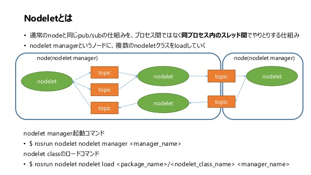

# ROS Nodelets

Author: methylDragon  
Fairly comprehensive ROS crash course!  
I'll be adapting code and tutorial content from the ROS Tutorials: http://wiki.ros.org/ROS/Tutorials    
and ETHz http://www.rsl.ethz.ch/education-students/lectures/ros.html    

------

## Pre-Requisites

- A system with Ubuntu 16.04 installed (no other versions!)
- Linux
- C++
  - You should at least know classes and pointers
  - Sadly there is no Python nodelet implementation


## Table Of Contents <a name="top"></a>

1. [Introduction](#1)    
2. [Nodelets](#2)    
   2.1 [Introduction](#2.1)    
   2.2 [Running Nodelets from Launchfiles](#2.2)    
   2.3 [Nodelet Managers](#2.3)    
   2.4 [Writing Nodelets](#2.4)    
   2.5 [Augment the CMakeLists.txt file](#2.5)    
   2.6 [Augment the package.xml File](#2.6)    
   2.7 [Create nodelet_plugins.xml](#2.7)    
   2.8 [Create Your Nodelet!](#2.8)    
   2.9 [Nodelet Caveats](#2.9)    


## 1. Introduction <a name="1"></a>

> The nodelet package is designed to provide a way to run multiple algorithms in the same process with zero copy transport between algorithms. This package provides both the nodelet base class needed for implementing a nodelet, as well as the NodeletLoader class used for instantiating nodelets.
>
> <http://wiki.ros.org/nodelet>



[Image Source](<https://www.slideshare.net/yosukekurihara77/ros-nodelet-20160626-lt>)

They're an optimisation detail (albeit a pretty significant one!) Sometimes widely used especially in applications that deal with computer vision or point clouds in ROS.

Messages sent from nodelet to nodelet **within a nodelet manager** are instead sent by just passing the message pointer. So no actual transfer of the data pointed to by the pointer happens. This is particularly significant for message data that's huge, like videos, images, or point clouds.

You basically host multiple ROS node-like processes under a single process, saving time because you skip copying, and saving network bandwidth because no large messages are flying through your ROS network.


[Image Source](<https://answers.ros.org/question/230972/what-is-a-nodelet/>)


## 2. Nodelets <a name="2"></a>

### 2.1 Introduction <a name="2.1"></a>
[go to top](#top)


- Nodelets within a single nodelet manager process communicate with each other via the use of a shared pointer
  - Nodelet managers are ROS nodes on their own!
- In contrast, nodes communicate between themselves via TCP connections in ROS!

All topics that are subscribed or published are done through the nodelet manager as an interface.

Additionally, each nodelet is [bonded](<http://wiki.ros.org/bond>) to their nodelet manager, so that the nodelet manager can keep track of whether nodelets are alive or not, and vice versa!


### 2.2 Running Nodelets from Launchfiles <a name="2.2"></a>
[go to top](#top)


| Nodelet Launch Arg                     | Description                                                  |
| -------------------------------------- | ------------------------------------------------------------ |
| load \<pkg\>/\<type\> <manager_name\>  | Launch a nodelet on the nodelet manager named <manager_name> |
| standalone \<pkg\>/\<type\>            | Launch a nodelet in a standalone node                        |
| unload <nodelet_name\> <manager_name\> | Unload a nodelet named <nodelet_name\> on the nodelet manager named <manager_name\> |
| manager                                | Launch a nodelet manager node                                |

> The nodelet names are defined by the `name=""` attribute in the `<node>` tag in the launch XML.

**Example**:

```xml
<launch>
  <!-- Start a nodelet manager -->
  <node pkg="nodelet" type="nodelet" name="pcl_manager" args="manager" output="screen" />

  <!-- Run a VoxelGrid filter to clean NaNs and downsample the data -->
  <node pkg="nodelet" type="nodelet" name="voxel_grid" args="load pcl/VoxelGrid pcl_manager" output="screen">
    <remap from="~input" to="/camera/depth/points" />
    <rosparam>
      filter_field_name: z
      filter_limit_min: 0.01
      filter_limit_max: 1.5
      filter_limit_negative: False
      leaf_size: 0.01
    </rosparam>
  </node>
</launch>
```

So we can see from here that we are loading a pcl/VoxelGrid nodelet in the process that the pcl_manager nodelet manager is running on.

If we wanted to run it standalone, or kill the nodelet, we just use the corresponding launch argument.


### 2.3 Nodelet Managers <a name="2.3"></a>
[go to top](#top)


Nodelet managers are nodes that host nodelets on them. They facilitate the transfer of messages into and out of the nodelets if such connections need to be made on the ROS graph.

Since it's actually one process, if you want to run the nodelets in parallel, you have to set the `num_worker_threads` parameter like so:

```xml
<node pkg="nodelet" type="nodelet" name="threaded_manager" args="manager" output="screen">
    <!-- If not specified, the default value is 0 -->
    <param name="num_worker_threads" value="16" />
</node>
```

This way, the nodelet manager will have a **thread pool** that will be shared across all nodelets hosted by the manager.

> **Note**: Do also take note that as the nodelet managers host the nodelets on shared thread pool, nodelets that are blocking might cause issues with message transfer between nodelets and callback running. So **do ensure that the nodelet manager has enough threads to prevent this**.


### 2.4 Writing Nodelets <a name="2.4"></a>
[go to top](#top)


Nodelets work almost like normal ROS nodes in terms of what you can do with them in the code. **Except you should be writing them as a child class of the nodelet class**.

As such, you can use the publisher and subscriber interfaces (like the one in the `class_pub_sub` package, in the minimal projects directory) in nodelets, in much the same way!

You just need to settle some boilerplate, that we'll adapt from [this tutorial](http://wiki.ros.org/nodelet/Tutorials/Porting%20nodes%20to%20nodelets).


### 2.5 Augment the CMakeLists.txt file <a name="2.5"></a>
[go to top](#top)


Add `nodelet` as a dependency, and compile your nodelet as a library

```cmake
cmake_minimum_required(VERSION 2.8.3)
project(pub_sub_nodelet_example)

find_package(catkin REQUIRED COMPONENTS
  roscpp
  std_msgs
  nodelet # Here
)

catkin_package(
  INCLUDE_DIRS src
  CATKIN_DEPENDS roscpp std_msgs nodelet # And here
  DEPENDS system_lib
)

include_directories(
  ${catkin_INCLUDE_DIRS}
)

# Library addition here!
# In this case, I'm just calling my nodelet the name of the package
add_library(${PROJECT_NAME} src/PubSubNodelet.cpp)
target_link_libraries(${PROJECT_NAME} ${catkin_LIBRARIES})
```

You may also specify install targets

```cmake
install(FILES nodelet_plugins.xml
        DESTINATION ${CATKIN_PACKAGE_SHARE_DESTINATION}
)

install(DIRECTORY launch
        DESTINATION ${CATKIN_PACKAGE_SHARE_DESTINATION}/
)

install(DIRECTORY include/${PROJECT_NAME}/
        DESTINATION ${CATKIN_PACKAGE_INCLUDE_DESTINATION}
)
```


### 2.6 Augment the package.xml File <a name="2.6"></a>
[go to top](#top)


Add these lines, which will add the `nodelet` package as a dependency, as well as export the `nodelet_plugins.xml` you'll add next.

```xml
<build_depend>nodelet</build_depend>
<exec_depend>nodelet</exec_depend>

<export>
  <nodelet plugin="${prefix}/nodelet_plugins.xml" />
</export>
```


### 2.7 Create nodelet_plugins.xml <a name="2.7"></a>
[go to top](#top)


In this case, my nodelet is called `PubSubNodelet`, from the example package `pub_sub_nodelet_example`. Find and replace those strings for your own nodelets.

The `nodelet_plugins.xml` file will help let ROS know that your nodelet is an executable plugin, which is important for exposing it to the nodelet manager interfaces.

```xml
<library path="lib/libPubSubNodelet">
  <class name="pub_sub_nodelet_example/PubSubNodelet" type="pub_sub_nodelet_example::PubSubNodelet" base_class_type="nodelet::Nodelet">
  <description>
  Example nodelet that features publisher and subscriber capabilities.
  </description>
  </class>
</library>
```


### 2.8 Create Your Nodelet! <a name="2.8"></a>
[go to top](#top)


We're going to make an example pub-sub nodelet!

First we made a header file. **We'll place it in the `include/package_name` directory**.

In the case of the example, we'll call it `PubSubNodelet.h`, but you can use any name you want.

```c++
#include <ros/ros.h>
#include <std_msgs/String.h>
#include <nodelet/nodelet.h>

namespace pub_sub_nodelet_example
{
  class PubSubNodelet : public nodelet::Nodelet
  {
  protected:
    // Here's our node handle!
    ros::NodeHandle nh;

    // Init publisher and subscribers here
    ros::Publisher pub;
    ros::Subscriber sub;

    // These will be useful in the class implementation
    std_msgs::String message;
    unsigned int count = 0;

  public:
    virtual void onInit();
    void msgCB(const std_msgs::StringConstPtr& msg);
  };
}
```

**Notice that there is an onInit() method** that will get overwritten with your class implementation in the .cpp file you'll write. This onInit() method is called on initialisation of the nodelet!

So now, we'll create a corresponding `PubSubNodelet.cpp` in the `src` directory!

Some more important stuff are here.

> Notably, we need to interface with `pluginlib`.
>
> So we import it here
>
> ```c++
> #include <pluginlib/class_list_macros.h>
> ```
>
> And we export the nodelet class at the end as a plugin
>
> ```c++
> PLUGINLIB_EXPORT_CLASS(pub_sub_nodelet_example::PubSubNodelet, nodelet::Nodelet)
> ```

```c++
#include <pluginlib/class_list_macros.h>
#include "pub_sub_nodelet_example/PubSubNodelet.h"

ros::Rate r = ros::Rate(25);

namespace pub_sub_nodelet_example
{
  void PubSubNodelet::onInit()
  {
    // Init nodehandle
    nh = getNodeHandle();

    // Bind subscription topic
    sub = nh.subscribe("chatter", 1, &PubSubNodelet::msgCB, this);
    pub = nh.advertise<std_msgs::String>("chatter", 1);

    NODELET_INFO("NODELET READY!");

    while (ros::ok())
    {
      std::ostringstream string_count;
      string_count << count;
      message.data = "Rawr " + string_count.str();

      pub.publish(message);
      ros::spinOnce();
      r.sleep();

      count++;
    }
  }

  void PubSubNodelet::msgCB(const std_msgs::StringConstPtr& msg)
  {
    NODELET_INFO_STREAM(msg->data);
  }
}

// Export the nodelet as a plugin
PLUGINLIB_EXPORT_CLASS(pub_sub_nodelet_example::PubSubNodelet, nodelet::Nodelet)
```

Additionally! Notice that we didn't put the rate inside the class. There's a bunch of caveats with nodelets that you should be aware of, that we'll talk about in the next section.

> **Also note**: Notice how there isn't a `main()` function! This is because the main function will run within the nodelet manager instead, and the nodelet class will hitchhike on that host process instead!


### 2.9 Nodelet Caveats <a name="2.9"></a>
[go to top](#top)


**ROS Console Output**

You won't be able to use the normal `ROS_INFO()` type rosconsole methods! Instead, use the nodelet aware methods like `NODELET_INFO()`.


**Nodelet Constructor Overriding**

Any objects that require the class to have a non-empty constructor will stop the pluginlib export processes, since pluginlib needs to override the class constructor. So this includes stuff like **ROS Rate** objects. Including them in the nodelet class will cause issues. That's why in the example above, we put the ROS Rate on the outside of the class.


**A Warning for Nodelet Messages**

Remember again that nodelets pass messages within a nodelet manager via the use of shared pointers. As such, these two things must be respected:

- Message callbacks should be using the ptr type. (Though, whether you want to use a const ptr or not is up to you)
- Messages should **not** be edited on the publishing end after the messages have been published, as that will cause the message that is received on the subscribing end to also be changed, since the only thing that is actually passed is the message pointer, not the value!


**Outputting to Screen For Launchfiles**

When you want the nodelet to output stuff to screen, **set `output="screen"` on the manager, not the nodelet**. This is because the manager is the actual process that is wrapping the nodelet processes!

```xml
<launch>
  <node pkg="nodelet" type="nodelet" name="example_manager"  args="manager" output="screen"/>
  <node pkg="nodelet" type="nodelet" name="pub_sub_nodelet" args="load pub_sub_nodelet_example/PubSubNodelet example_manager"/>
</launch>
```


```
                            .     .
                         .  |\-^-/|  .    
                        /| } O.=.O { |\
```

​    

------

[.png)](https://www.buymeacoffee.com/methylDragon)